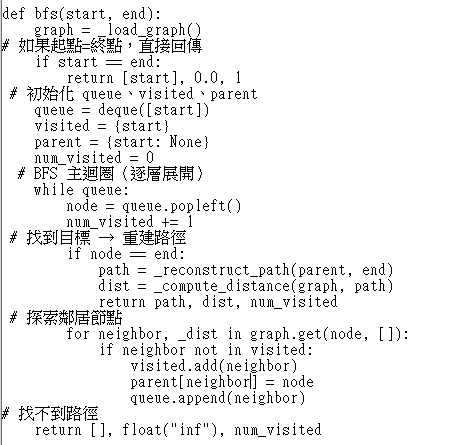
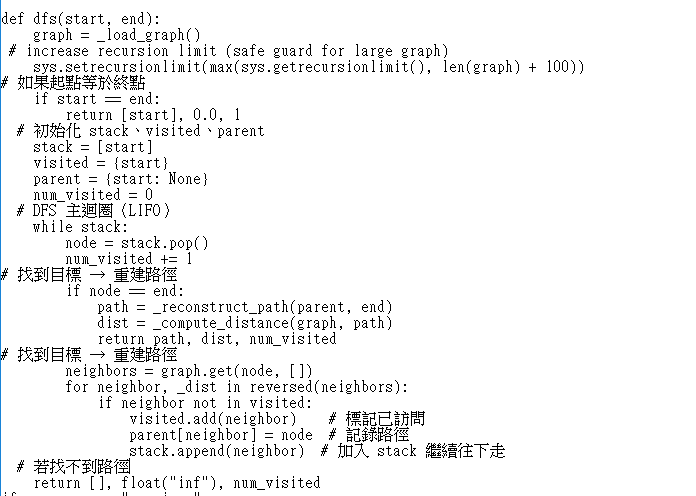
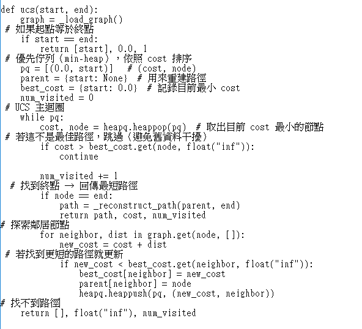
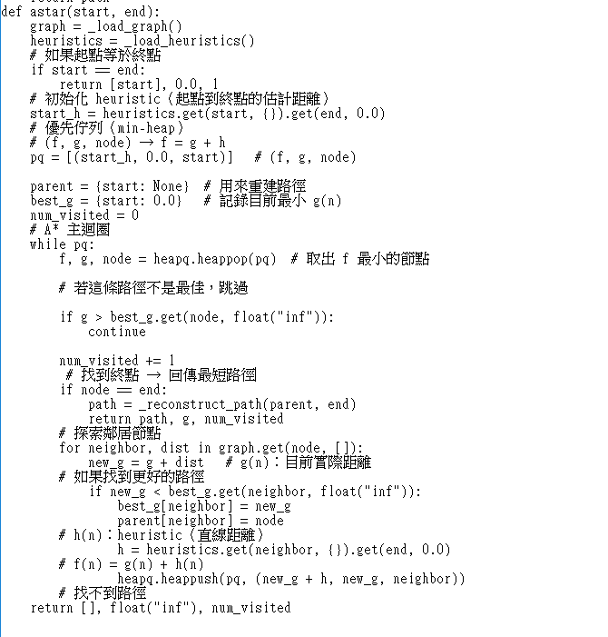
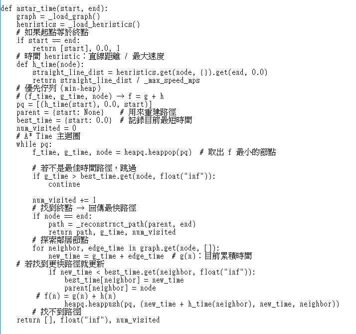

# Homework 1: Route Finding Report

* Name: JEN,JIN-XIAN
* Student ID: 513558002

---

## Part I. Implementation (10%)

### BFS
Breadth-First Search (BFS) explores nodes level by level using a queue (FIFO).  
In this implementation, a queue is used to ensure nodes are expanded in order of depth.  
A visited set is used to prevent revisiting nodes, and a parent dictionary is used to reconstruct the final path.  
Although BFS guarantees finding a valid path, it does not guarantee the shortest-distance path in weighted graphs.
 
 

---

### DFS
Depth-First Search (DFS) explores nodes by going as deep as possible along one branch before backtracking.  
This is implemented using a stack (LIFO).  
A visited set prevents infinite loops, and a parent dictionary is used to reconstruct the path.  
DFS is simple but does not guarantee optimal solutions and often produces very long paths.

 
---

### UCS
Uniform Cost Search (UCS) expands nodes based on the smallest accumulated path cost using a priority queue.  
Each node stores the current best cost, and the algorithm updates the cost if a shorter path is found.  
Because all edge weights are non-negative, UCS guarantees the shortest path in terms of distance.

 
---

### A* Search
A* Search extends UCS by incorporating a heuristic function.  
The evaluation function is:

f(n) = g(n) + h(n)

where g(n) is the path cost so far, and h(n) is the estimated remaining cost using straight-line distance.  
This heuristic is admissible, so A* still guarantees optimality while significantly reducing node expansions.

 
---

### A* Time Search
A* Time modifies A* to minimize travel time instead of distance.  
The edge cost is calculated as:

time = distance / speed

The heuristic is:

h(n) = straight_line_distance / max_speed

This ensures the heuristic is admissible because no path can be faster than the maximum possible speed.  
This approach better reflects real-world navigation scenarios.

 
---

## Part II. Results & Analysis (15%)

### 1. Map Results

**Public Case 1**  
Start: 2773409914  
End: 1079387396  

#### BFS

#### DFS

#### UCS

#### A* Search

#### A* Time Search

---

### 2. Comparison Table

| Algorithm | Path length | Nodes expanded | Execution time (s) | Observation |
| :---- | :---: | :---: | :---: | :---- |
| BFS | 5500.115 | 20715 | 0.105 | Finds a valid path but not optimal |
| DFS | 290333.568 | 18390 | 0.114 | Produces extremely long path due to deep exploration |
| UCS | 4894.677 | 17051 | 0.137 | Guarantees shortest path |
| A* Search | 4894.677 | 1486 | 0.270 | Same optimal path as UCS with fewer expansions |

---

### Analysis

From the table above, BFS and DFS both find valid paths but do not guarantee optimality.  
DFS performs the worst because it explores deeply without considering path cost, resulting in an extremely long path.

BFS performs better than DFS but still cannot guarantee the shortest path in a weighted graph.

UCS guarantees the shortest path by expanding nodes with the lowest accumulated cost.  
However, it still explores many nodes, which leads to higher computational cost.

A* Search produces the same shortest path as UCS, confirming that the heuristic is admissible.  
It significantly reduces the number of expanded nodes, demonstrating higher efficiency.  

Interestingly, although A* expands far fewer nodes than UCS, its execution time is slightly higher in this experiment.  
This is due to the additional overhead of heuristic computation and priority queue operations.

Overall, A* provides the best balance between optimality and efficiency.

---

### 3. Difference between A* and A* Time

A* Search minimizes physical distance, while A* Time minimizes travel time.  

A* prefers shorter-distance paths, even if speed limits are lower.  
A* Time considers both distance and speed, so it may choose longer routes if they allow faster travel.

The heuristic in A* Time is scaled by speed, making it suitable for estimating travel time rather than distance.  
This makes A* Time more practical for real-world navigation systems.

---

## Part III. Question Answering (25%)

### 1. Problem encountered and solution

During implementation, I encountered a problem in the A* Time algorithm.  
Initially, I stored edge information in inconsistent formats, which caused runtime errors during execution.  
Some parts of the graph used travel time directly, while other parts still depended on distance and speed information.  
I fixed this issue by using a consistent graph representation and calculating edge costs in a unified way.  
After correcting the data structure, the algorithm worked properly.

---

### 2. Handling visited nodes

A visited set is used to prevent revisiting nodes in BFS and DFS, while a cost dictionary is used in UCS and A*.  

If the visited check is removed:

- BFS will repeatedly enqueue the same nodes, increasing memory usage and slowing execution.
- DFS may get trapped in cycles and fail to terminate efficiently.

Thus, visited checks are essential for correctness and performance.

---

### 3. When UCS equals BFS

UCS and BFS produce the same path when all edges have equal weight.  

In this case, minimizing path cost is equivalent to minimizing the number of edges.  
Therefore, BFS and UCS will return the same result.

---

### 4. Admissibility and heuristic discussion

An admissible heuristic never overestimates the true cost to the goal.  

If the heuristic overestimates, A* may lose optimality and return a suboptimal path.

Euclidean distance is suitable for real-world maps because it represents the shortest possible path.  
However, it ignores road structure.

Manhattan distance is useful for grid-like maps but less suitable for irregular road networks.

---

### 5. Novel heuristic design

A possible heuristic is:

h(n) = straight_line_distance / estimated_local_speed

Instead of using a global speed, this uses local road conditions to estimate speed.  
Additional inputs such as road type or traffic conditions can improve accuracy while maintaining admissibility.
